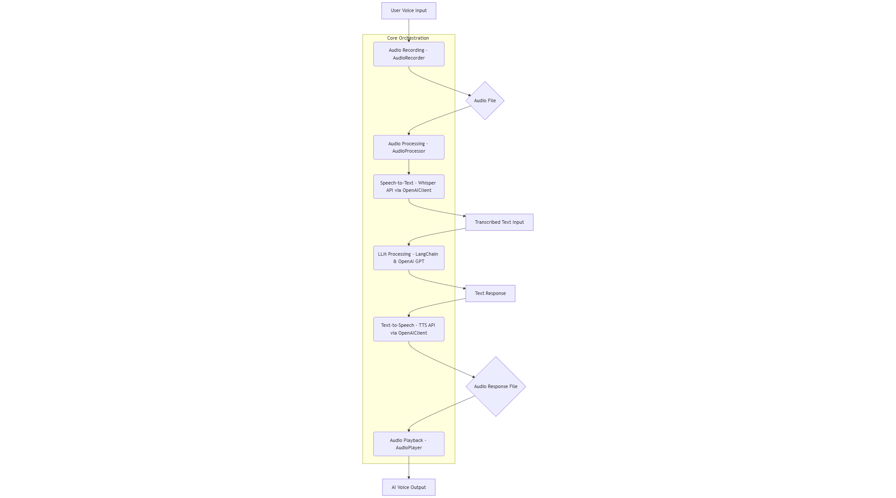

# System Architecture

The Voice-Controlled LLM App is designed as a modular, multimodal AI application, enabling seamless voice-to-voice interaction with Large Language Models. Its architecture is divided into distinct components, promoting maintainability, scalability, and clarity.

## 1. High-Level Overview

The core flow of the application involves a pipeline:

**User Voice Input 🎤 → Audio Recording → Speech-to-Text → LLM Processing → Text-to-Speech → Audio Playback 🗣️**

This entire pipeline is orchestrated by the central `VoiceLLM` class.

## 2. Component Breakdown

The `src/` directory contains the core application logic, structured into several key modules:

### 2.1. src/main.py (Main CLI Entry Point)

**Role:** The primary entry point for running the application in Command Line Interface (CLI) mode.

**Responsibilities:**
- Parses command-line arguments (e.g., `--mode`, `--record-duration`)
- Initializes the VoiceLLM orchestrator
- Manages the main conversation loop, handling user input and AI responses
- Implements basic error handling and graceful shutdown

### 2.2. src/app.py (Streamlit Web Interface)

**Role:** Provides an optional web-based graphical user interface (GUI) for interacting with the application.

**Responsibilities:**
- Builds the Streamlit UI elements (text input, audio file upload, chat display)
- Leverages the VoiceLLM instance in a session-aware manner
- Simulates audio input via file uploads and plays back synthesized audio directly in the browser

**Note:** Does not handle real-time microphone access or local audio playback directly due to browser security models and Streamlit's environment.

### 2.3. src/voice_llm.py (Core Orchestrator)

**Role:** The central class that ties all other components together to manage the end-to-end voice-to-voice conversation pipeline.

**Responsibilities:**
- Instantiates and manages AudioRecorder, AudioPlayer, AudioProcessor, OpenAIClient, and LangChain components (LLM, Memory, ConversationChain)
- Orchestrates the sequence of operations: recording, transcription, LLM generation, speech synthesis, and playback
- Maintains conversation state and utilizes configured settings
- Provides high-level methods for starting a CLI conversation or processing individual text/audio inputs (for web integration)

### 2.4. src/audio/ (Audio Handling)

#### recorder.py:
- **Role:** Manages capturing audio from the user's microphone
- **Technology:** Uses `sounddevice` and `soundfile`
- **Responsibilities:** Starts/stops recording, saves recorded audio to temporary files

#### player.py:
- **Role:** Manages playing back synthesized audio responses to the user
- **Technology:** Uses `sounddevice` and `soundfile`
- **Responsibilities:** Plays audio files from disk

#### processor.py:
- **Role:** Provides utilities for manipulating audio files
- **Technology:** Uses `pydub` (which often requires ffmpeg or libav system dependencies)
- **Responsibilities:** Format conversion (e.g., MP3 to WAV), and basic silence removal (placeholder for more advanced noise reduction)

### 2.5. src/api/ (External API Integrations)

#### openai_client.py:
- **Role:** A foundational client for all OpenAI API interactions
- **Responsibilities:** Handles authentication with `OPENAI_API_KEY`, and provides direct methods for:
  - `transcribe_audio` (Whisper)
  - `get_chat_completion` (GPT)
  - `synthesize_speech` (TTS)

#### whisper.py:
- **Role:** Specific wrapper for Speech-to-Text via OpenAI Whisper
- **Responsibilities:** Offers a simple `transcribe` method that internally calls `openai_client.transcribe_audio`

#### tts.py:
- **Role:** Specific wrapper for Text-to-Speech via OpenAI TTS
- **Responsibilities:** Offers a simple `synthesize` method that internally calls `openai_client.synthesize_speech`

### 2.6. src/llm/ (Language Model Logic)

#### chains.py:
- **Role:** Configures and provides different LangChain ConversationChain instances
- **Technology:** LangChain
- **Responsibilities:** Integrates LLM (e.g., ChatOpenAI), Memory, and Prompt templates to define conversational flows (e.g., default, creative, technical)

#### memory.py:
- **Role:** Manages the conversation context and history
- **Technology:** LangChain's ConversationBufferMemory
- **Responsibilities:** Stores past user inputs and AI responses to maintain continuity in conversations

#### prompts.py:
- **Role:** Defines and retrieves various ChatPromptTemplate instances
- **Technology:** LangChain's prompt templates
- **Responsibilities:** Houses system messages and structures for different conversational personas (default, creative, technical)

### 2.7. src/utils/ (Utilities)

#### config.py:
- **Role:** Manages application settings and environment variables
- **Technology:** `python-dotenv`
- **Responsibilities:** Loads configurations from `.env` file, provides easy access to parameters like API keys, model names, and debug settings. Includes validation.

#### logger.py:
- **Role:** Sets up centralized logging for the application
- **Responsibilities:** Configures console and file logging, allowing for different log levels (INFO, DEBUG, etc.)

#### helpers.py:
- **Role:** Contains general-purpose utility functions
- **Responsibilities:** Functions like generating timestamped filenames, ensuring directory existence

## 3. Configuration (config/)

- **config/prompts/:** Stores raw text files for various system prompt templates (`default.txt`, `creative.txt`, `technical.txt`). These are loaded by `src/llm/prompts.py`
- **config/models.yaml:** (Planned) A YAML file to define and manage different LLM model configurations (e.g., parameters like `max_tokens`, `temperature`, `tts_voice` specific to a model). This can be used to dynamically load model settings

## 4. Data (data/)

- **data/audio/input/:** Directory for temporarily storing recorded or uploaded user audio files
- **data/audio/output/:** Directory for temporarily storing generated AI speech audio files
- **data/audio/processed/:** Directory for temporarily storing audio files after processing (e.g., format conversion, silence removal)
- **data/logs/:** Directory for storing application log files
- **data/conversations/:** (Planned) Directory for saving conversation history (e.g., as JSON files)

## 5. Scripts (scripts/)

- **setup.sh:** Automates virtual environment creation and dependency installation
- **test.sh:** Runs unit and integration tests using pytest
- **deploy.sh:** A versatile script to aid in deploying the application (e.g., locally, via Docker, or providing guidance for cloud VMs)

## 6. Dependencies

Managed by `requirements.txt` (core app) and `requirements-dev.txt` (development tools), ensuring a consistent and reproducible environment. Key dependencies include `langchain`, `openai`, `streamlit`, `sounddevice`, `soundfile`, `python-dotenv`, `numpy`, and `pydub`.

This modular design ensures clear separation of concerns, making the application easier to develop, test, and maintain.